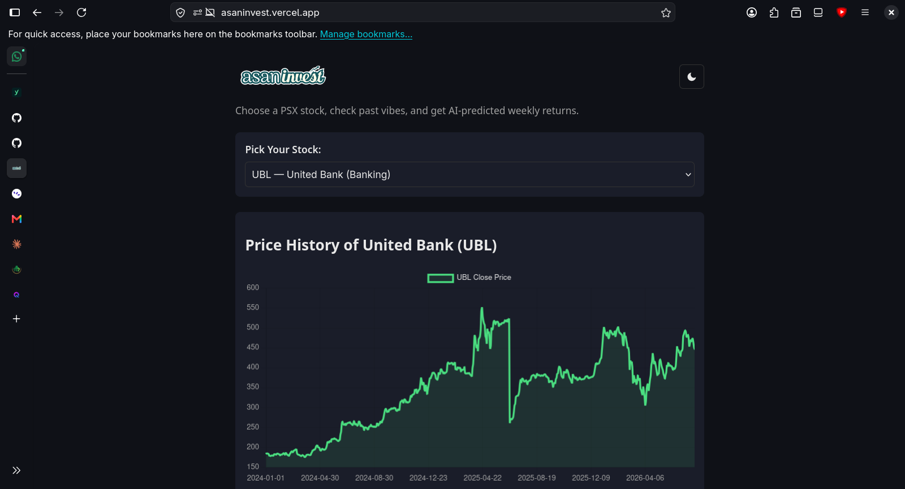
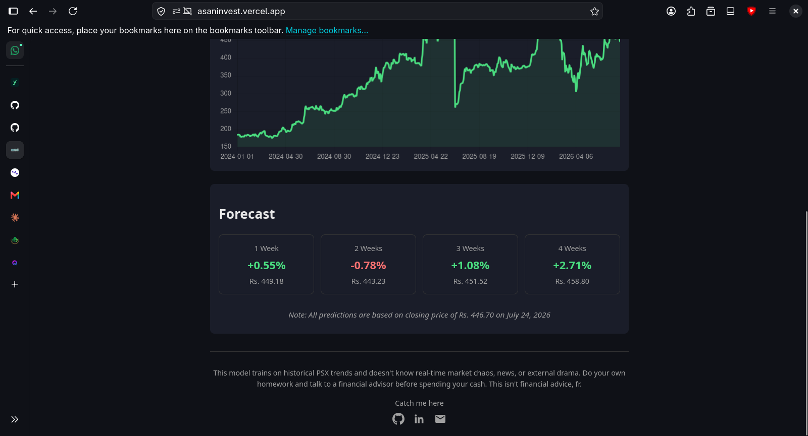
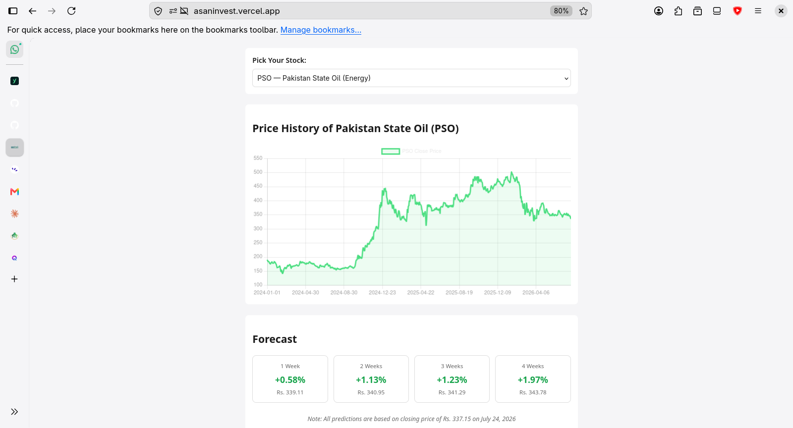
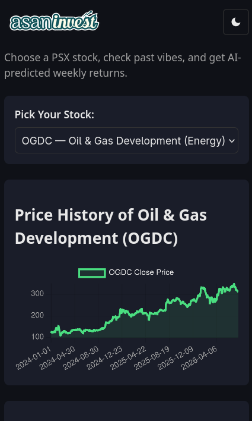
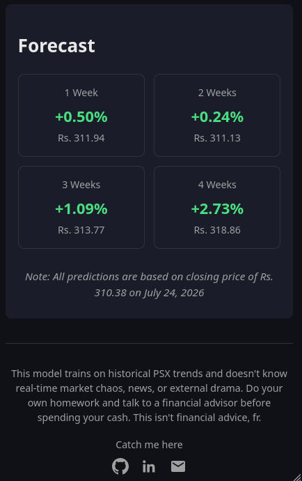

# asaninvest — AI-Powered PSX Stock Forecasting

**asaninvest** helps retail investors in Pakistan get a quick, data-backed read on PSX stocks before deciding whether to dig deeper. Pick a stock, see its recent price history, and get an AI-generated forecast of expected returns over the next 1 to 4 weeks, all in one place.

Most retail investors in Pakistan currently rely on tips, social media chatter, or gut feeling when picking PSX stocks, there's no free, simple tool that combines historical price data with a data-driven forecast. asaninvest fills that gap.

## Live Demo

**[https://asaninvest.vercel.app](https://asaninvest.vercel.app)**

Backend API: [https://asaninvest.fastapicloud.dev](https://asaninvest.fastapicloud.dev) ([interactive docs](https://asaninvest.fastapicloud.dev/docs))

> Note: the backend runs on a free-tier host and may take 30–60 seconds to wake up on the very first request after a period of inactivity. Subsequent requests are fast.

## Features

- **24 curated PSX stocks** across 9 sectors (Banking, Energy, Oil Marketing, Cement, Fertilizer, Power, Technology, Automobile, Financial Services)
- **Interactive price history chart** for each stock, powered by Chart.js
- **AI-powered 4-week forecast**: predicted % return and rupee amount at 1, 2, 3, and 4 week horizons, along with the closing price and date the forecast is based on
- **Dark / light theme toggle** with persisted preference
- **Fully responsive** design, works on mobile and desktop
- **Daily automated data refresh**: a scheduled pipeline re-fetches market data and retrains all models every day, so forecasts stay current without manual intervention
- Clear disclaimer throughout, forecasts are informational only, not financial advice

## The AI Feature

At the core of asaninvest are **four self-trained Random Forest regression models**, one for each forecast horizon (1, 2, 3, and 4 weeks). These are not pretrained or third-party models, they were trained from scratch on historical PSX data collected specifically for this project.

**What the models predict**: given a stock's recent trading data, each model predicts the expected percentage return over its horizon (5, 10, 15, or 20 trading days ahead respectively), calculated cumulatively from today's closing price, not from the previous horizon's prediction.

**Features the models use** (per stock, per day):
- Daily return (% change in closing price)
- 5-day and 20-day moving average ratios (current price relative to its recent average, not raw price, so the model generalizes across stocks with very different price levels)
- 5-day rolling volatility
- Daily volume change
- Sector (one-hot encoded), so the model can learn sector-specific patterns

**Training approach**: all 24 stocks are combined into a single training set (rather than training a separate model per stock), giving each model far more data to learn general market patterns from, while still being able to differentiate behavior by sector. Data is split by date (not randomly) into training and test sets to avoid leaking future information into training.

**Performance** (Mean Absolute Error on held-out test data):

| Horizon | MAE |
|---|---|
| 1 week | ~4.8% |
| 2 weeks | ~6.6% |
| 3 weeks | ~8.5% |
| 4 weeks | ~9.4% |

Error naturally increases with horizon length, this is expected and consistent with how difficult multi-week stock prediction is, even for professional quantitative models. These numbers are presented honestly rather than hidden: predicting exact stock returns weeks in advance is a genuinely hard problem, and the value of the tool is in giving a data-driven starting signal, not a guaranteed outcome.

## Tools, Services, and Models Used

- **Data source**: [psxdata](https://pypi.org/project/psxdata/) (free, open-source Python library that scrapes PSX market data directly, no API key required)
- **Backend**: Python, FastAPI, scikit-learn (Random Forest Regressor), pandas, joblib
- **Dependency management**: [uv](https://docs.astral.sh/uv/)
- **Frontend**: Plain HTML, CSS, and JavaScript, Chart.js for charting
- **Backend hosting**: [FastAPI Cloud](https://fastapicloud.com)
- **Frontend hosting**: [Vercel](https://vercel.com)
- **Automation**: GitHub Actions, scheduled daily workflow that re-fetches data, retrains all models, and commits the results, both hosts auto-redeploy on push

## Screenshots

*(Add at least 3 screenshots here, e.g. the stock selector + chart view, the forecast cards, and the mobile view. Save them in a `screenshots/` folder and reference them like this:)*

```markdown





```

## How to Run the Project

### Prerequisites
- Python 3.11+
- [uv](https://docs.astral.sh/uv/) installed

### Backend

```bash
cd backend
uv sync
uv run python fetch_data.py      # fetches and caches PSX historical data
uv run python train_model.py     # builds features and trains all 4 models
uv run uvicorn main:app --reload # starts the API at http://127.0.0.1:8000
```

Visit `http://127.0.0.1:8000/docs` for interactive API documentation.

### Frontend

```bash
cd frontend
python -m http.server 5500
```

Visit `http://127.0.0.1:5500`. To point the frontend at your local backend instead of the live one, update `API_BASE_URL` at the top of `app.js`.

### Data Pipeline

- `backend/fetch_data.py` — fetches ~2 years of daily OHLCV data for all 24 tickers via psxdata, with retry logic and rate limiting
- `backend/check_data.py` — validates cached data for completeness, duplicates, and OHLC consistency
- `backend/train_model.py` — builds features, trains and evaluates all 4 Random Forest models
- `backend/predict.py` — loads trained models and generates live predictions
- `.github/workflows/refresh-data.yml` — runs the fetch + train pipeline daily and commits any changes automatically

## Project Structure

```
asaninvest/
  backend/
    main.py, predict.py, train_model.py, fetch_data.py, check_data.py
    tickers.py, schemas.py
    data/cache/       (cached historical CSVs)
    model/             (trained model files)
  frontend/
    index.html, style.css, app.js
    assets/
  .github/workflows/
    refresh-data.yml
```

## Disclaimer

Forecasts are generated by a model trained on historical PSX data and are for informational purposes only. The model does not account for real-time market conditions, news events, or other external factors that may affect stock prices. Users should conduct their own research and consult a financial advisor before making investment decisions.

## Author

Built by Muhammad Muzammil
[GitHub](https://github.com/muzammilsharf)
[Linkedin](https://www.linkedin.com/in/m-muzammil-/)

## License

MIT